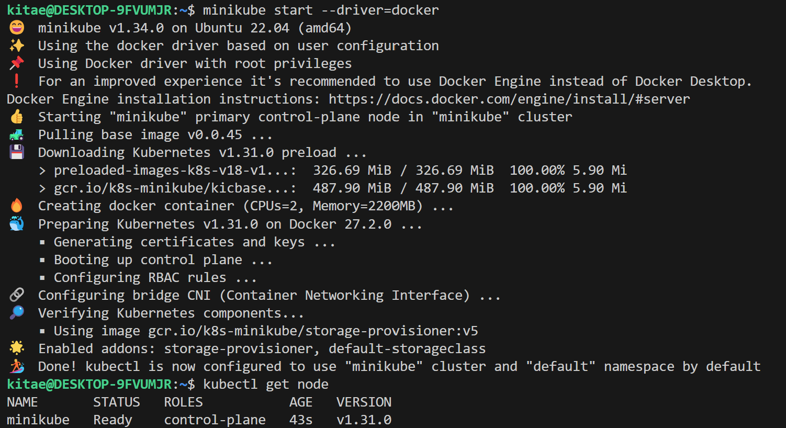
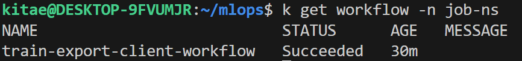
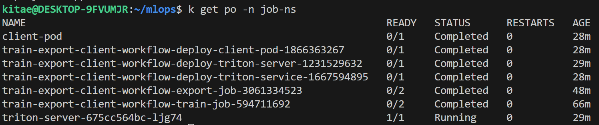
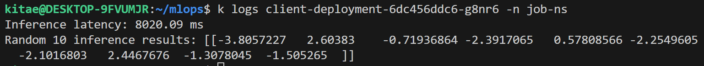
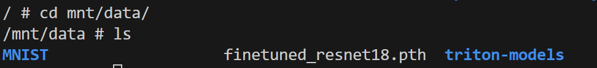

# mlops

# 프로젝트 소개

Model train/export, inference 클라이언트를 위한 환경을 Minikube 위에 구성하고, Triton Inference Server를 사용하여 Inference를 처리하는 시스템을 구축함. 

- Minikube 및 로컬 Docker 이미지 레지스트리 설정.
- Kubernetes Job을 이용한 모델 학습 및 export.
- Triton Inference Server와 클라이언트 배포.
- train, export, triton-server, client 의 단계적 배포를 argo workflow 이용 자동 배포 프로세스 적용
- **ResNet-18** 모델과 **MNIST 데이터셋**을 사용하여 학습 및 Inference 처리.
- **architecture/** 경로 내에 아키텍쳐 다이어그램 및 인프라 명세서 위치.

## Prerequisites

- [Docker](https://docs.docker.com/get-docker/)
- [Minikube](https://minikube.sigs.k8s.io/docs/start/)
- [Kubectl](https://kubernetes.io/docs/tasks/tools/install-kubectl/)
- [Helm](https://helm.sh/docs/intro/install/)
---

## 1. **Minikube 및 Docker 환경 설정**

### Minikube 시작

Minikube 클러스터를 시작
```bash
minikube start --driver=docker
```

### 로컬 Docker 환경 연결

Minikube의 Docker 환경을 사용하기 위해 Minikube Docker 환경 설정
```bash
eval $(minikube docker-env)
```

### 로컬 Docker 이미지 레지스트리 설정

Minikube에 내장된 로컬 Docker 레지스트리를 활성화
```bash
minikube addons enable registry
```

Minikube 내에서 이미지를 로컬 레지스트리에 푸시가능

---

## 2. **Dockerfile 및 Python 스크립트 기반 이미지 빌드**

`train.py`, `export.py`, `client.py` 각각에 맞는 Dockerfile을 작성(`scripts/` 내)

- `train.py`: 모델 학습을 위한 Python 스크립트, GPU가 없는 CPU 환경에서 학습하므로 빠른 테스트 진행 위해 epoch 1로 설정
- `export.py`: 모델 export를 위한 Python 스크립트 
- `client.py`: TritonServer에 gRPC 요청을 보내고 latency 및 result 로깅하는 클라이언트 스크립트 

각 작업에 맞는 **Dockerfile** 생성

- `Dockerfile.tr_ex`: 모델 학습 및 export을 위한 이미지 빌드
- `Dockerfile.client`: 클라이언트 실행을 위한 이미지 빌드

---

## 3. **Docker 이미지 빌드 및 로컬 레지스트리에 푸시**

로컬 환경에서 각각의 Dockerfile로 이미지를 빌드하고, Minikube의 레지스트리에 이미지 push

### Train & export 이미지 빌드 및 푸시

```bash
docker build -t localhost:5000/tr-ex-job:v1.0 -f Dockerfile.tr_ex . && docker push localhost:5000/tr-ex-job:v1.0
```

### Client 이미지 빌드 및 푸시

```bash
docker build -t localhost:5000/client-job:v1.0 -f Dockerfile.client . && docker push localhost:5000/client-job:v1.0
```
---

## 4. **NS, RBAC, PVC, Argo Workflow 생성**

작업이 수행될 NameSpace 및 모델 학습 및 export, 인퍼런스 결과 로깅을 위한 PVC를 생성하고, workflow에서의 리소스 생성을 위한 RBAC를 적용. 프로젝트 단계별로 Job을 정의하고, 의존성 처리를 위한 argo workflow 설치

### NS 생성

```bash
kubectl apply -f manifests/ns.yaml
```
### PVC 생성

```bash
kubectl apply -f manifests/pvc-model-log.yaml
```
### RBAC 생성

```bash
kubectl apply -f manifests/rbac.yaml
```

### Argo Workflow 설치 및 확인

프로젝트 단계별로 Job을 정의하고, 의존성 처리를 위한 argo workflow 설치

```bash
helm repo add argo https://argoproj.github.io/argo-helm
helm repo update
helm install argo-workflows argo/argo-workflows --namespace argo --create-namespace
kubectl get pods -n argo
```
---

## 5. **Workflow 배포**

train-export-triton-client로 이어지는 step 별 작업을 위한 workflow 구성 및 배포

```bash
kubectl apply -f manifest/workflow-all.yaml
```

**Workflow로 전과정을 진행하지 않고 사용하지 않고 manifests/ 경로의 triton-deploy, clent-pod, workflow-train-export.yaml를 이용하여 train/export만 workflow로 진행 및 triton-server, client-pod은 수동으로 배포가능**

---

## 6. **결과 확인**

### Kubernetes 리소스 상태 확인

모든 리소스가 정상적으로 배포되었는지 확인

```bash
kubectl get workflow -n job-ns
kubectl get pods -n job-ns 
```



### Client Pod의 로그 확인

```bash
kubectl logs <client-pod-name> -n job-ns
```
로그에서 **Inference Latency**와 **Inference 결과**를 확인가능


### PVC-Check-Pod 이용 모델/로그 확인

workflow 수행후 같은 pvc가 마운트 된 pod를 배포하여 pvc 저장 정보 확인
```bash
kubectl apply -f manifests/pvc-check-pod.yaml
kubectl exec -it pvc-check-pod -n job-ns -- sh
```

